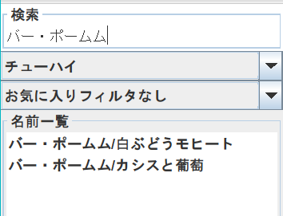

# 飲んだよデータベース

## プログラムの概要

このプログラムは、お酒に関する記録をつけ、保存や共有を行うことができる。

自分用のお酒情報データベースとしての役割、自分の好みや味の感想を記録する役割、仲間にお酒の情報を共有する役割の3つを併せ持ったプログラムとなっている。

## 操作方法

#### ①データ登録

新規ボタンを押し、名前、製造を入力してお酒の種類をプルダウンから選択する。製造は空白でも良い。入力が終わったら追加ボタンを押す。

 

#### ②データ選択、レビュー入力

レビューを入力したいデータの名前をリストから選択しクリックすると、情報が表示される。  
その後感想を入力したり、星評価、お気に入りマーク、カウンターを選択することができる。テキストフィールドを入力した際は更新ボタンを押す

 

#### ③更新、削除

名称以外のデータは更新が行える。 お気に入り登録と星評価は選択した時点でデータの更新が行われる。 他の入力については書き換えたあとに更新ボタンを押すことで更新される。

データを選択してから削除ボタンを押すことで、その名称のお酒のデータが削除される。削除の際にはポップアップで確認がされる。

#### ④保存、開く

メニューバーを押して保存ボタンを押し、既存のtxtファイルを選択または存在しないtxtファイル名を入力することで上書き保存、新規保存の両方が行える。

メニューバーを押して開くボタンを押し、txtファイルを選択すると開くことが出来る。

#### ⑤検索

リスト下の検索ボタンを押すことでブラウザが開く。

#### ⑥ツイート

リスト下の「飲んだよツイート」ボタンを押すことでツイートができる。

#### ⑦終了

メニューバーを押して終了ボタンを押すことでプログラムが終了する。

## 機能

#### ①お酒の情報、レビューの入力

入力できる情報は「名称・お酒の種類・製造会社・情報」で、 レビューとして記録できるのは「レビューコメント、星評価、お気に入り登録」。

お酒の種類はプルダウンで、星評価は星1~5から選択する。お気に入り登録はチェックマークの有無で行う。「飲んだよカウンター」は押すと1上がり、どのくらい飲んだお酒かを覚えておくことが出来る。

#### ②情報の保存

.txtファイルとしてこれらが保存される。保存したデータを再度開くことが出来る。

#### ③記録を見返す

保存した情報をリストから選択して見返すことが出来る。

また、お酒の種類とお気に入り登録の有無でフィルタを掛けて、表示するデータを絞ることが出来る。

検索欄にてワードでフィルタを掛けることもできる。

   

#### ④情報の検索

ブラウザを開いて今選択しているお酒の名称を検索した結果のページに飛ぶことが出来る。 上位に表示されるであろう公式の商品ページから、お酒の情報や製造元を見つけてデータ登録に役立てることが出来る。

#### ⑤ツイートでの共有

ツイートボタンを押すとTwitter(現X)が開かれ、自動で名称や評価、レビューコメントが入ったツイート文が入力された状態となり、すぐにツイートが行える。

  

## ポイント・工夫点

#### ・フィルタ機能について

種類・お気に入り・ワードの3種類のフィルタを組み合わせることで、データの量が多くなっても目的のデータを探し出すのが楽になっている。

#### ・ボタンのenabledについて

ボタンや入力欄の動作可否を細かく設定することで、エラー回避をダイアログや処理飛ばしに頼らない設計にしている。
またこれによって、初めてプログラムを利用する人が操作の解説無しでも直感的に操作できるように工夫している。

起動時点では「新規」ボタンのみが動作可能で、 新規ボタンを押すと「名前、製造、情報」欄と「登録」ボタンが動作可能になり、
登録後は全ての入力欄と「新規」「更新」「削除」ボタン、「検索」「飲んだよツイート」「飲んだよカウンター」ボタン、そして星評価とお気に入り登録が動作可能になる。

#### ・検索ボタンについて

検索と記録をプログラム内で同時に行うことができるため、情報を確実にこのデータベースにまとめておくことができる。
製造会社や製品情報は普段意識しないので登録時に迷いがちであるが、プログラム利用時に検索しつつ入力することができる。

#### ・ツイートボタンについて

飲んだお酒の記録と同時にTwitter(現X)で共有することができ、美味しかったお酒を友だちに共有したり、いつ飲んだかのメモとしても使うことができる。